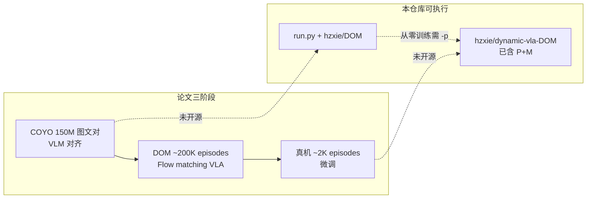
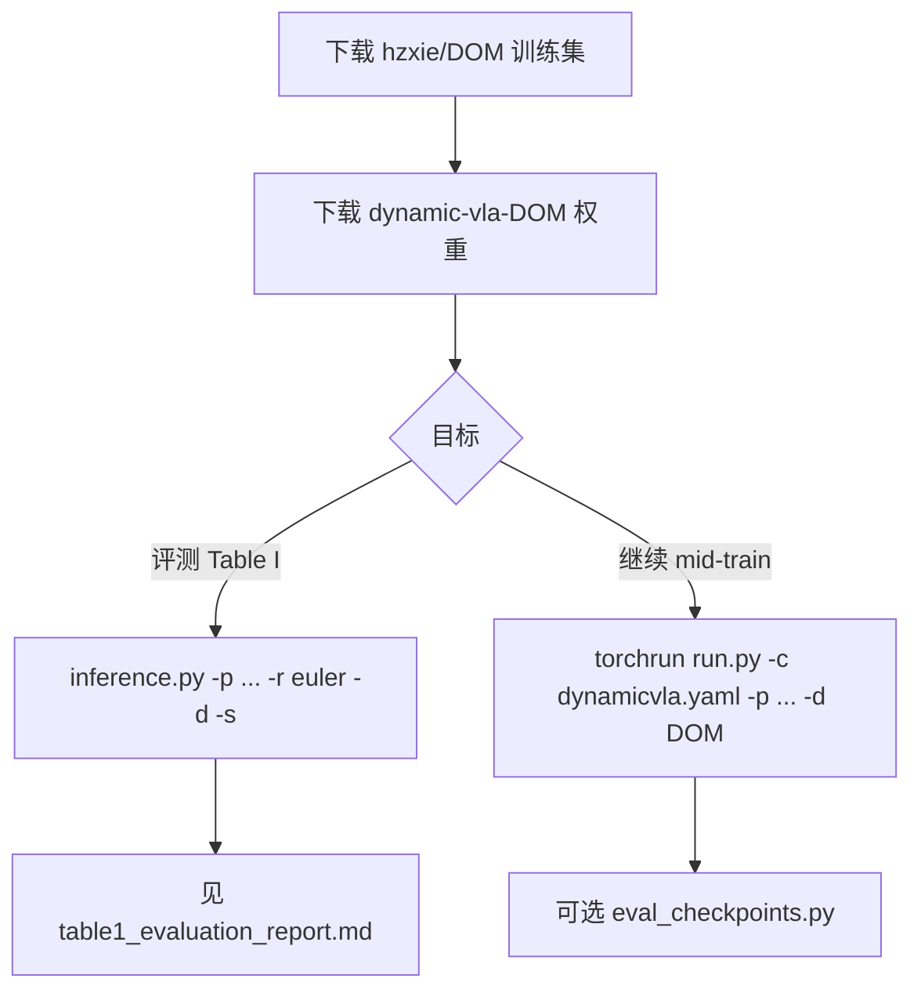

# DynamicVLA 训练复现报告

> **论文**：[DynamicVLA](https://arxiv.org/abs/2601.22153)（arXiv:2601.22153）  
> **仓库**：[hzxie/DynamicVLA](https://github.com/hzxie/DynamicVLA)  
> **关联文档**：[Table I 评估复现报告](table1_evaluation_report.md)（仿真评测，非训练）  
> **撰写时间**：2026-05-22

---

## 摘要

DynamicVLA 在论文中采用 **三阶段训练**（COYO 预训练 → DOM 合成数据中训练 → 真机后训练）。本开源仓库 **仅覆盖 Mid-training 这一条路径**（`run.py` + LeRobot DOM 数据），并发布已含 COYO+DOM 的整包权重 `hzxie/dynamic-vla-DOM`。预训练与后训练 **无独立脚本与数据管线**；在未使用 `-p` 加载官方 checkpoint 时，默认冻结的 VLM 骨干为 **随机初始化**，无法等价复现论文。

**推荐实践路径**：下载 DOM 训练集 → 以 `dynamic-vla-DOM` 为起点继续训练或直接使用 → 按 [table1_evaluation_report.md](table1_evaluation_report.md) 做 Table I 评测。

---

## 1. 三阶段训练对照（论文 vs 本仓库）

论文 Appendix **B–C**（*The Training Scheme* / *Implementation Details*）将训练分为三阶段；下表与仓库能力对照。

| 阶段 | 论文数据与目标 | 论文资源（约） | 本仓库 |
|------|----------------|----------------|--------|
| **Pre-training** | COYO-700M 采样 **150M** 英文图文对；FastViT + SmolLM2-360M 各自用单模态预训练权重初始化，再做大规模 **vision–language 对齐** | **32×A100**，batch **40/GPU**，AdamW lr=1e-4，约 **2 天** | **无**：无 COYO 脚本、无 `coyo` 引用、无 VLM caption 训练入口 |
| **Mid-training** | 合成 **DOM** 约 **200K episodes**（2.8K 场景、206 物体）；在 DOM 上训练完整 VLA，action expert 用 **flow matching**（论文 Eq.1） | 同上集群，约 **10 天** | **有**：`torchrun run.py -c configs/dynamicvla.yaml -d hzxie/DOM`；HF 数据集约 **207,306** episodes |
| **Post-training** | 真机演示约 **2K episodes**；与 mid-training **相同目标**，适配新本体与传感器 | 约 **2 天** | **无**：无真机 LeRobot 管线；论文后训练未开源 |

### 1.1 训练流水线（概念）



### 1.2 论文与仓库训练目标差异

| 阶段 | 损失 / 模块 | 仓库 `run.py` 路径 |
|------|-------------|-------------------|
| Pre-training | 图文 **caption / 自回归 LM**（需保留 `lm_head`） | `VLMWithExpertModel` 会 **删除** `vlm.lm_head`（`modeling_vlm_with_expert.py`），DOM 训练为 **flow matching MSE** |
| Mid-training | Eq.1 flow matching + 冻结或微调 VLM | `configs/dynamicvla.yaml` + `core/train.py` |
| Post-training | 同 mid-training | 无真机数据入口 |

---

## 2. 预训练为什么在本仓库「不行」

以下原因叠加，使得 **无法在本仓库内从零复现 COYO 预训练阶段**；实践上应通过 **`hzxie/dynamic-vla-DOM`** 继承作者已完成的 COYO+DOM 权重。

### 2.1 无 COYO 工程与数据引用

- 全仓库 **无任何 `COYO` / `coyo` 字符串**。
- 无 COYO 下载、清洗、分片、多卡预训练脚本。
- 论文仅引用 COYO-700M 数据集文献；实现留在作者侧。

### 2.2 骨干构建使用 `from_config`，非 `from_pretrained`

`configs/dynamicvla.yaml` 指定 `VLM_MODEL_NAME: HuggingFaceTB/SmolLM2-360M`。构建路径（`modeling_dynamicvla.py` → `_get_vlm_with_expert`）为：

- `AutoConfig.from_pretrained(vlm_model_name)` — **仅拉配置**；
- `FastVLMForConditionalGeneration(config=...)` — **整 VLM 随机初始化**。

`modeling_fastvlm.py` 中：

```307:312:policies/dynamicvla/modeling_fastvlm.py
        self.vision_model = FastViT(config.vision_config)
        self.connector = FastVLMConnector(config)
        self.text_model: LlamaModel = AutoModel.from_config(config.text_config)
```

- **Vision**：仓库内为 DynamicVLA **定制 FastViT**（多帧通道、RepCPE 等），**无** HF 权重自动加载；
- **Text**：`from_config`，**不是** `AutoModel.from_pretrained("HuggingFaceTB/SmolLM2-360M")`；
- 注释参考 [apple/FastVLM-0.5B](https://huggingface.co/apple/FastVLM-0.5B) 仅为结构参考，**无** timm/ImageNet 或 Apple 权重映射代码。

### 2.3 默认 `FREEZE_*` + 无 `-p` → 随机冻结骨干

`configs/dynamicvla.yaml`：

```yaml
FREEZE_VISION_MODEL: true
FREEZE_CONNECTOR: true
FREEZE_TEXT_MODEL: true
```

若训练时 **不** 传入 `-p`（`run.py` → `cfg.CONST.CKPT` → `core/train.py` 的 `from_pretrained`）：

- VLM 三部分均为 **随机初始化且冻结**；
- 可训练部分主要为 **action expert**、`state_proj` 等；
- **不能** 等价论文「COYO 对齐后的 FastViT+SmolLM2 再 DOM 训练」。

`core/train.py` 仅在 `CONST.CKPT` 存在时加载整包权重：

```109:133:core/train.py
    if "CKPT" in cfg.CONST:
        logging.info("Loading pretrained model from %s ..." % cfg.CONST.CKPT)
        ...
            policy = policy.from_pretrained(cfg.CONST.CKPT, config=policy.config)
```

### 2.4 COYO 阶段与 DOM 训练代码目标不一致

| 项目 | COYO 预训练（论文） | DOM mid-training（本仓库） |
|------|---------------------|---------------------------|
| 目标 | 视觉–语言表示对齐 | 动作 chunk 的 flow matching |
| `lm_head` | 需要（caption / LM loss） | `VLMWithExpertModel` 初始化时 **删除** |
| 数据 | 150M 图文对 | LeRobot DOM（状态 + mp4） |

要在本仓库「近似」COYO，需 **另写** 训练脚本：使用 `FastVLMForConditionalGeneration` + `labels`，**不要** 走删 `lm_head` 的 `VLMWithExpertModel` 路径——工作量接近新子项目，而非改几行配置。

### 2.5 若坚持自研 COYO：方向性说明（非仓库能力）

1. 准备 COYO-700M 子集（论文 150M 英文对）与多卡训练框架。  
2. 至少对 **SmolLM2-360M** 改为 `from_pretrained` 加载文本塔；FastViT 需手工 `state_dict` 对齐或接受随机 vision。  
3. COYO 结束后再进入 DOM：加载 COYO checkpoint 到 `DynamicVLAPolicy`，并视情况将 `FREEZE_*` 设为 `false`。  
4. 论文规模：**32×A100 × 约 2 天**；单卡需大幅缩规模或接受效果差距。

**省事做法**：`./setup/download_assets.sh --model`，训练时 **始终** `-p pretrained_weights/dynamic-vla-DOM`。

---

## 3. 后训练为什么不行

### 3.1 无真机数据管线

- 仓库 **没有** 真实机器人演示 → LeRobot 的采集、标定、上传脚本。  
- `README.md` 训练章节仅 `-d hzxie/DOM`（合成 DOM）。  
- 论文 Post-training：约 **2K 真机 episodes**，**未随本 repo 发布**。

### 3.2 仅有仿真数据生成链

开源数据路径面向 **Isaac Lab 合成 DOM**，而非真机：

| 步骤 | 脚本 | 环境 |
|------|------|------|
| 仿真采集 | `simulations/simulate.py` | `isaaclab` |
| 轨迹重放 | `scripts/translate_dataset_seq.py` | `isaaclab` |
| LeRobot 转换 | `scripts/create_lerobot_dataset.py` | `dynamicvla-train` |

该管线产出的是 **与 HF `hzxie/DOM` 同类的合成数据**，不能替代论文真机后训练。

### 3.3 与评测、Table I 的区分

- **Table I / 真机 16 tasks** 属于 **评测叙事** 或作者私有后训练权重，不是 `run.py` 默认流程。  
- 本仓库可复现的是 **仿真 DOM 上的 `dynamic-vla-DOM` 评测**，见 [table1_evaluation_report.md](table1_evaluation_report.md)。

---

## 4. Mid-training 复现要点

### 4.1 推荐命令

**PyTorch 环境**（`dynamicvla-train`），仓库根目录：

```bash
# 1) 下载 DOM 训练集与官方权重（数据根默认在仓库上一级，见 setup/README.md）
./setup/download_assets.sh --train --model

# 2) 分布式 mid-training（README 示例：8 GPU）
torchrun --nnodes=1 --nproc_per_node=8 --standalone run.py \
  -c configs/dynamicvla.yaml \
  -p pretrained_weights/dynamic-vla-DOM \
  -d hzxie/DOM
```

| 参数 | 含义 |
|------|------|
| `-c configs/dynamicvla.yaml` | 500 epochs、batch 44、lr 1e-4、cosine + 1000 warmup 等 |
| `-p .../dynamic-vla-DOM` | **强烈建议**：继承 COYO+DOM 整包权重 |
| `-d hzxie/DOM` | LeRobot v2.1 数据集名（本地路径由 LeRobot 缓存/环境变量决定） |

若数据已下载到 `../datasets/DOM`（`--data-root` 默认布局），`-d` 仍写 HF repo id `hzxie/DOM` 或本地等效配置，需与 LeRobot 数据集注册方式一致（以你环境中的 `datasets/DOM` 为准）。

### 4.2 配置要点（`configs/dynamicvla.yaml`）

| 项 | 值 | 说明 |
|----|-----|------|
| `TRAIN.N_EPOCHS` | 500 | 完整 mid-training 轮数 |
| `TRAIN.BATCH_SIZE` | 44 | **每 GPU** batch（README 8 卡示例） |
| `POLICY.CHUNK_SIZE` / `N_ACTION_STEPS` | 20 | 与 flow matching chunk 一致 |
| `DATASET.USE_DELTA_ACTION` | true | 与推理 `-d` 一致 |
| `FREEZE_*` | 均为 true | 依赖 `-p` 提供已训练骨干 |

论文：**32×A100，batch 40/GPU**。本配置 batch 44/GPU × 8 卡仅为 README 示例；单卡或少量 GPU 需按显存调 `BATCH_SIZE` / `nproc_per_node`，训练时间会显著长于论文 **~10 天**。

### 4.3 资源估算

| 场景 | GPU | 论文历时（mid） | 实践说明 |
|------|-----|-----------------|----------|
| 论文 | 32×A100 | ~10 天 | batch 40/GPU |
| README 示例 | 8×（未指定型号） | 未给出 | batch 44/GPU，epoch 500 |
| 单机 1–4 卡 | 消费级/工作站 | 数周量级（粗估） | 需减小 batch 或接受欠收敛 |

**当前状态（本机复现语境）**：DOM 训练集自 Hugging Face **`hzxie/DOM`** 下载 **进行中**；HF 进度条显示的是**单个文件**大小，全集体积大、耗时长。加速与断点续传见 `setup/README.md`（`HF_ENDPOINT`、勿误开 `hf_transfer` 等）。

### 4.4 训练期评测（可选）

`scripts/eval_checkpoints.py` 可在训练时对接 `evaluate.py` 服务端做 checkpoint 评测（需先起仿真服务），参数见 `README.md`。

---

## 5. 数据说明

### 5.1 LeRobot DOM：parquet 与视频分离

| 组件 | 内容 | 体积特点 |
|------|------|----------|
| **parquet** | `observation.state`、`action` 等 **数值轨迹** | 单文件可很小（**不含图像像素**） |
| **mp4** | `observation.images.opst_cam`、`wrist_cam` 等 | 占数据集主体体积 |

因此下载时看到「十几 MB 的 parquet」并不代表数据集已完整；需等待 **视频分片** 全部就绪。

### 5.2 训练数据 vs 评测数据（切勿混用）

| 用途 | 来源 | 路径/标识 |
|------|------|-----------|
| **Mid-training** | HF `hzxie/DOM`（~207K episodes） | `datasets/DOM/`（`--train`） |
| **Table I 评测** | DOM Testing Set + `test-envs.txt` | `tests/`、`test-envs.txt`（90 环境 × 20 trials） |

`test-envs.txt` **不是** 训练集列表；把测试环境当训练数据会导致 **泄漏** 与指标虚高。评测流程见 [table1_evaluation_report.md](table1_evaluation_report.md)。

### 5.3 用户自建数据：simulate → translate → create_lerobot

若需 **扩充合成 DOM**（非论文 200K 规模的全量复现，而是增量实验）：

```bash
# isaaclab
python3 simulations/simulate.py --headless --enable_cameras --seed 42 --save --task place

python3 scripts/translate_dataset_seq.py \
  --dataset_dir ../datasets --output_dir ../datasets-tr \
  --enable_cameras --headless --save

# dynamicvla-train
python3 scripts/create_lerobot_dataset.py \
  --dataset_dir ../datasets-tr --repo <your_hf_repo> --rotation euler
```

再将 `-d` 指向你的 LeRobot repo。真机采集需自建硬件栈与标注，**超出** 当前仓库范围。

### 5.4 HF DOM 规模

- 论文表述：约 **200K** synthetic episodes。  
- Hugging Face `hzxie/DOM`：约 **207,306** episodes（以 HF 页面元数据为准）。  
- 与 COYO **150M 图文对** 量级完全不同，不可混谈。

### 5.5 训练数据是否只含「成功」episode

> **结论（默认管线）**：**是** — 从 `simulate.py` 到 `translate_dataset_seq.py` 再到 LeRobot 打包，训练用轨迹在工程上 **等价于仅保留任务成功终止的 episode**；`create_lerobot_dataset.py` 与 `run.py` **不再** 做 success 过滤，而是信任上游已筛好的 `-tr` 数据。HF 发布的 `hzxie/DOM` **无** 独立的 success 元数据字段，与「全量成功演示」叙事一致。

#### 5.5.1 论文表述

- Appendix / 正文描述 **Scene Modification (SM) 演示** 与约 **200K synthetic episodes**，强调场景与物体多样性，**未** 逐字写明「仅 success」或「丢弃失败 rollout」。  
- 从任务定义可推断：episode 应对应 **pick / place 等任务完成** 的操纵轨迹，而非超时、碰撞或中途停止的废轨迹；开源管线用 **终止条件 + 后处理** 落实这一隐含假设。

#### 5.5.2 各阶段过滤（代码依据）

| 阶段 | 脚本 | 成功 / 质量过滤 | 说明 |
|------|------|-----------------|------|
| **Raw 采集** | `simulations/simulate.py` | **强** | `termination_cfg` 中 `DONE_TERMS = ["object_picked", "objects_placed"]`；`simulate()` 返回前用 `is_done = term_mgr.get_term(done_term)`，**仅** 将 `is_done` 为真的 env 写入 `env_states`（`debug` 模式例外，见 [§5.5.4](#554-例外与误区)）。落盘前另跳过 `is_object_stopped` / `is_object_direction_changed`（碰撞导致物体过早静止或初速异常）。 |
| **重放 / 精炼** | `scripts/translate_dataset_seq.py` | **更强** | 重放循环以同一 `done_term` 判定 `success`；`--save` 时要求 `success`（`assert success or args.debug`），并剔除 `is_cam_occluded`、`is_object_occluded`（object/container）、空 `instruction.objects`；产出 `*-tr.h5` / `*-tr.json`。 |
| **LeRobot 打包** | `scripts/create_lerobot_dataset.py` | **无** | 遍历输入目录下 `.h5`，读相邻 `.json` 元数据；**不** 读取或校验 `success` 字段。 |
| **训练** | `run.py` → `core/train.py` | **无** | LeRobot `Dataset` 按 episode 索引加载 parquet + mp4；**无** success 列过滤。 |
| **官方集** | HF `hzxie/DOM` | **不可直接验** | LeRobot v2.1 元数据含任务、相机、状态等；**无** `success` / `is_success` 类字段 — 发布方假定数据已由上述管线生成。 |

**Raw vs `-tr` 数量关系**：同一条 raw episode 经 translate 可能因重放未再次达到 `done_term`、遮挡或 assert 失败而 **不落盘**；故 `datasets-tr/` 条数通常 **≤** `datasets/` raw 条数（附录 [§A.3](#a3-主要风险与规避caveats) 已提示 translate 强过滤）。

#### 5.5.3 快速核验（本地自建链）

| 检查项 | 做法 | 预期 |
|--------|------|------|
| **条数对比** | `ls ../datasets/*.h5 \| wc -l` vs `ls ../datasets-tr/*-tr.h5 \| wc -l` | `-tr` ≤ raw；差值越大说明过滤越狠 |
| **JSON 无 success 字段** | `jq 'keys' ../datasets-tr/<episode>-tr.json`（或 `python -m json.tool`） | 仅有 `scene` / `instruction` / `seed` 等仿真配置，**无** `success` 键 — 成功性已 **编码在「该文件是否存在」** |
| **translate 日志** | 开启 `--debug` 时观察 `SUCCESS` / `FAIL` 后缀的调试 mp4 | 正式 `--save` 路径下失败轨迹不应写入 `-tr` |
| **HF DOM** | 浏览 `meta/info.json` 或单条 `episodes/*.parquet` schema | 同样 **无** success 列；只能信任作者生成管线与论文 200K 叙事 |

#### 5.5.4 例外与误区

| 情况 | 后果 |
|------|------|
| **`simulate.py --debug`** | `is_done` 过滤放宽，**可能** 保存未完成任务轨迹的 raw `.h5` |
| **`translate_dataset_seq.py --debug`** | `assert success` 不触发，调试视频可标 `FAIL`，但 **`--save` 仍要求** 非遮挡等条件；勿把 debug 产出当训练集 |
| **跳过 translate，直接对 raw `datasets/` 跑 `create_lerobot`** | raw 轨迹语义、相机与 `-tr` 不一致，且 **含** 非成功终止样本 — **不符合** 默认训练假设（附录 [§A.6](#a6-何时应判定为-no不建议继续)） |
| **「HF 上有 success 字段」** | 当前 DOM schema **没有**；不能靠 LeRobot 加载时再筛失败 episode |

**与 [§5.3](#53-用户自建数据simulatetranslatecreate_lerobot) 的关系**：官方 `hzxie/DOM` 与自建数据应走同一 **simulate → translate → create_lerobot** 链；仅当 `-d hzxie/DOM` 全量下载时，成功性过滤发生在 **作者侧批量管线**，本仓库消费者 **无法在 `run.py` 内再区分成败**。

---

## 6. 思考：开源边界与可执行路径

> 参考链接 [ChatGPT 分享](https://chatgpt.com/share/6a0fc5e7-650c-43a2-803d-3cdde40822ad) **已无法访问**（对话已删除）。本节综合本仓库调研与对话中的共识。

### 6.1 开源 ≈ Mid-training only

作者发布的是 **DOM 上的训练循环 + 已训好的 `dynamic-vla-DOM`**，而非完整三阶段流水线。COYO 与真机后训练在论文中完成，**未** 以独立工程形式开源。这是 VLA 论文常见模式：**重评测与 mid 权重，轻预训练/后训练工程**。

### 6.2 权重策略：始终考虑 `-p dynamic-vla-DOM`

| 目标 | 建议 |
|------|------|
| 复现 Table I 主结果 | 推理 `-p pretrained_weights/dynamic-vla-DOM`（见 [table1_evaluation_report.md](table1_evaluation_report.md)） |
| 在 DOM 上继续训练 | 同上 `-p`，避免随机冻结骨干 |
| 从零训练且不加载 `-p` | **不推荐**；等价放弃 COYO+DOM 先验 |

### 6.3 Table II 消融 [1][2][3] 与训练的关系

Table II（Continuous Inference / LAAS 消融）属于 **推理期机制**，与 mid-training **无单独 checkpoint**。当前仓库：

- 仅发布 **`dynamic-vla-DOM`** 一套权重；  
- **不能** 仅凭开关完整复现 Table II 的 **[2] 仅 LAAS**、**[3] 仅 CI**（CI 与 LAAS 在 streaming 路径中 **未解耦**）；  
- 去掉 `-s` 可 **近似** [1]（无 CI、无 LAAS），数值未必与论文 30.27% 一致。

完整 Table II 需改 `modeling_dynamicvla.py` 或重训/作者未发布的消融权重——与 **训练复现** 正交，但影响「是否误以为训练能产出 [2][3] 行」。

### 6.4 训练数据 vs 评测数据分离

- **训练**：LeRobot DOM，episode 级 parquet + mp4。  
- **评测**：`test-envs.txt` + Isaac `evaluate.py` + `inference.py`。  
- 对话中 **90×1 smoke ~53.3%** 与 **1800×20 ~51.06%** 差异主要来自 **每环境 trial 数** 与 **方差**，宏平均公式一致；正式对比论文 Table I 应使用 **`-n 20`**（见评估报告）。

### 6.5 推荐实践路径（端到端）



1. **DOM 下载完成** → 校验 parquet + 视频完整性。  
2. **评测优先**：用官方权重跑通 Table I（评估报告已记录一次 RTX 4090 结果）。  
3. **训练实验**：在 `-p dynamic-vla-DOM` 上微调或从头调参，并记录与论文 32×A100 的资源差异。  
4. **不要** 在本 repo 内期待 COYO / 真机后训练「开箱即用」。

### 6.6 常见误区速查

| 误区 | 事实 |
|------|------|
| 「跑 `run.py` 就等于复现全文训练」 | 仅 mid-training；预训练/后训练缺失 |
| 「SmolLM2 在 yaml 里就会加载 HF 权重」 | 仅 `from_config`，需 `-p` 整包或改代码 |
| 「test-envs.txt 可当训练列表」 | 仅评测；训练用 `hzxie/DOM` |
| 「parquet 下完就等于 DOM 下完」 | 视频才是大头 |
| 「Table II [2][3] 靠训练配置切换」 | 推理消融，且 CI/LAAS 未独立暴露 |
| 「训练集里混有失败 episode，run.py 会过滤」 | 默认管线在 simulate/translate 已筛；HF DOM 无 success 字段（[§5.5](#55-训练数据是否只含成功-episode)） |

---

## 7. 参考文献与仓库索引

| 主题 | 位置 |
|------|------|
| 论文训练方案 | arXiv:2601.22153 Appendix B–C |
| 训练入口 | `run.py`, `core/train.py`, `configs/dynamicvla.yaml` |
| VLM 构建 / freeze | `policies/dynamicvla/modeling_dynamicvla.py`, `modeling_fastvlm.py`, `modeling_vlm_with_expert.py` |
| 数据下载 | `setup/download_assets.sh`, `setup/README.md`, `setup/urls.sh` |
| 仿真数据管线 / 成功性过滤 | `simulations/simulate.py`, `scripts/translate_dataset_seq.py`, `scripts/create_lerobot_dataset.py`；见 [§5.5](#55-训练数据是否只含成功-episode) |
| 官方权重 | [hzxie/dynamic-vla-DOM](https://huggingface.co/hzxie/dynamic-vla-DOM) |
| 官方训练集 | [hzxie/DOM](https://huggingface.co/datasets/hzxie/DOM) |
| Table I 评测 | [table1_evaluation_report.md](table1_evaluation_report.md) |

---

## 附录：小规模仿真训练链路可行性评估

> **结论：GO（附条件）** — 可验证 **simulate → translate → create_lerobot → run.py** 全链路能跑通、loss 能下降；**不能** 等价论文 mid-training（~200K episodes、32×A100、~10 天）。  
> **与正文关系**：当 [§4 Mid-training](#4-mid-training-复现要点) 依赖的 **`hzxie/DOM` 全量下载过慢** 时，本附录给出用 **自建小规模合成数据** 做训练冒烟的替代路径。

### A.1 用户提议路径

| 步骤 | 规模 / 设定 | 成功判据 |
|------|-------------|----------|
| 1. `simulations/simulate.py` | 仿真采集约 **100** 条 raw episode（`-n 100`） | 产出 `.h5` + `.json` |
| 2. `scripts/translate_dataset_seq.py` | 对 raw 重放、过滤、写 `-tr` 轨迹 | 有效 episode 写入 `datasets-tr/` |
| 3. `scripts/create_lerobot_dataset.py` | 转为 LeRobot v2.1 | 本地 `lerobot/<repo_id>/` 可枚举 episode |
| 4. `torchrun run.py`（**1 GPU**） | 训练约 **50 epoch**，`BATCH_SIZE` 2–4 | **train loss 单调或总体下降**（过拟合冒烟即可） |

该路径目标是 **工程可行性 / 管线冒烟**，不是复现论文 DOM mid-training 指标。

### A.2 为何判定为可行

| 依据 | 说明 |
|------|------|
| **无最小 episode 门槛** | `create_lerobot_dataset.py` 仅要求输入目录存在 `.h5`；**未** 硬编码最少条数，单条亦可打包 |
| **50 epoch 足够冒烟** | 几十条 episode 在 1 GPU、小 batch 上足以 **过拟合**；loss 下降即可证明数据字段、视频键、action 维与 `run.py` 对齐 |
| **官方数据链一致** | 与 [§5.3](#53-用户自建数据simulatetranslatecreate_lerobot) 相同：**simulate → translate → create_lerobot**；HF `hzxie/DOM` 亦由该链大规模生成 |
| **相机数差异可接受** | 仿真/translate 常产出 **3** 路相机（如 `opst_cam` + `wrist_cam` + 第三视角）；`configs/dynamicvla.yaml` 训练仅读 **`opst_cam`、`wrist_cam`** 两路——多出的键由数据集 metadata 保留，**不影响** `run.py` 加载 |

### A.3 主要风险与规避（Caveats）

| 风险 | 影响 | 建议 |
|------|------|------|
| **Isaac Lab + 资产** | 无 `isaaclab` 环境，或缺少 `../scenes`、`../objects`（USD） | 先按 `setup/README.md` 准备仿真依赖；`translate` 依赖与 `evaluate` 相同的场景/物体目录 |
| **translate 强过滤** | 仅保存 **成功终止** 且 **非遮挡** 的轨迹（机制见 [§5.5](#55-训练数据是否只含成功-episode)）；raw 100 条可能只剩 **几十条** 可用 | 仿真侧建议 **`-n 150–200`（raw）**，使 translate 后仍 ≥50–80 条；**不可跳过 translate** |
| **必须 enable cameras** | 无 `--enable_cameras` 则无 RGB，后续 LeRobot 视频为空 | simulate / translate 均带 `--enable_cameras --headless`（及 `--save`） |
| **单 GPU batch** | 默认 `BATCH_SIZE: 44` 显存易爆 | 覆盖为 **`TRAIN.BATCH_SIZE: 2–4`**，`nproc_per_node=1` |
| **随机骨干** | 无 `-p` 时 VLM 冻结且随机（见 [§2.3](#23-默认-freeze_-无--p--随机冻结骨干)） | 冒烟请 **`-p pretrained_weights/dynamic-vla-DOM`**，否则 loss 下降仅证明 action 头在拟合噪声先验 |
| **CLI 参数名** | `create_lerobot` 使用 **`--repo_id`**，非 `--repo` | 例：`--repo_id local/smoke-dom` |
| **训练轮数 / warmup** | 全量 500 epoch + 1000 warmup 对冒烟过长 | 建议覆盖 **`TRAIN.N_EPOCHS: 5`**、**`TRAIN.LR_SCHEDULER.N_WARMUP_STEPS: 100`**（仍可用 cosine） |

### A.4 推荐命令片段（缩写）

**环境**：simulate / translate → `isaaclab`；create_lerobot / train → `dynamicvla-train`。仓库根目录，数据默认在 `../datasets`、`../datasets-tr`。

```bash
# 1) 仿真 raw（建议 raw 150–200，下例 100）
python3 simulations/simulate.py --headless --enable_cameras --save \
  -n 100 --task place --seed 42

# 2) translate（不可省略）
python3 scripts/translate_dataset_seq.py \
  --dataset_dir ../datasets --output_dir ../datasets-tr \
  --enable_cameras --headless --save

# 3) LeRobot 打包（注意 --repo_id）
python3 scripts/create_lerobot_dataset.py \
  --dataset_dir ../datasets-tr --repo_id local/smoke-dom --rotation euler

# 4) 单 GPU 冒烟训练（复制 dynamicvla.yaml，设 N_EPOCHS=5、BATCH_SIZE=4、N_WARMUP_STEPS=100）
torchrun --nnodes=1 --nproc_per_node=1 --standalone run.py \
  -c configs/dynamicvla_smoke.yaml \
  -p pretrained_weights/dynamic-vla-DOM \
  -d local/smoke-dom
```

若本地 LeRobot 路径与 HF id 不一致，需保证 `-d` 与 `HF_LEROBOT_HOME` 下数据集注册名一致（与 [§4.1](#41-推荐命令) 相同原则）。

### A.5 耗时粗估（单机，量级）

| 阶段 | 假设 | 粗估耗时 |
|------|------|----------|
| simulate raw ×100 | 1 GPU，headless + cameras | **2–6 h**（任务难度、机器差异大） |
| translate ×100 | 逐条 Isaac 重放 | **3–8 h** |
| create_lerobot | CPU + 视频拷贝/编码 | **0.5–2 h** |
| train 5 epoch ×50 ep 有效 | 1×4090/24G，`BATCH_SIZE=4` | **0.5–2 h** |
| **合计（冒烟）** | raw 100 → 有效 ~50–70 | **约 1–2 天** |
| 对比：HF DOM 全量 mid-train | ~207K ep，8–32 GPU | **数天–数周（仅下载）+ 论文 ~10 天训练** |

### A.6 何时应判定为 NO（不建议继续）

| 条件 | 原因 |
|------|------|
| 无法安装 **Isaac Lab** 或拿不到 **scenes/objects** | simulate / translate 均不可执行 |
| translate 后 **有效 episode < 10** | 难以观察稳定 loss 曲线；应加大 `-n` 或放宽任务难度 |
| 坚持 **不加载 `-p dynamic-vla-DOM`** 却期望「像论文一样」收敛 | 冻结随机 VLM，冒烟无意义 |
| 目标为 **Table I 论文级成功率** | 需全量 DOM + 官方权重 + [table1_evaluation_report.md](table1_evaluation_report.md) 流程，非本附录规模 |
| 期望 **单卡 BATCH_SIZE=44** 复现 README | 显存不足；且 episode 数差 3–4 个数量级 |
| 跳过 **translate** 直接 `create_lerobot` on raw | 轨迹/相机语义与训练集不一致，易在 `run.py` 或视频键上报错 |

### A.7 与 Mid-training 章节的交叉引用

| 场景 | 优先路径 |
|------|----------|
| DOM 已完整下载，追求论文 mid-training | [§4](#4-mid-training-复现要点)、[§5.1–5.2](#51-lerobot-domparquet-与视频分离) |
| DOM 下载慢 / 仅需验证训练代码与数据格式 | **本附录** 小规模仿真链 → 再切回 `-d hzxie/DOM` |
| 评测 vs 训练数据 | 训练用 DOM 或自建 LeRobot；**勿** 用 `test-envs.txt`（[§5.2](#52-训练数据-vs-评测数据切勿混用)） |

---

*本报告基于 DynamicVLA 仓库代码、论文 Appendix B–C 及项目内训练/评测对话整理；ChatGPT 外链不可用时，「思考」一节由上述材料归纳。*
